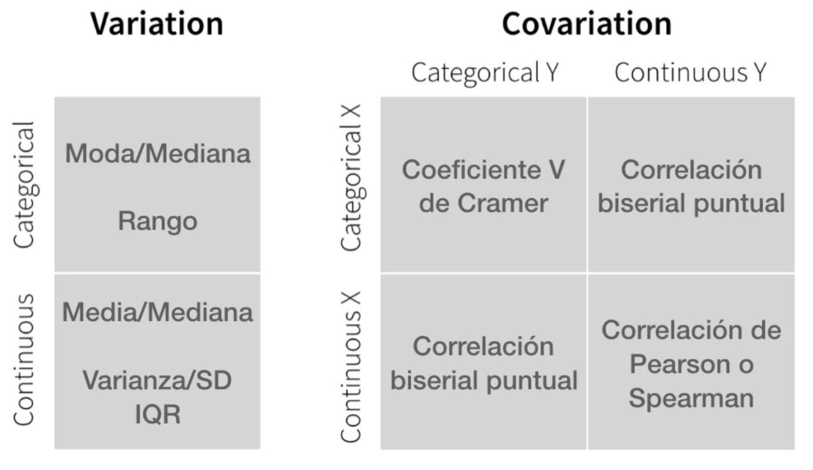
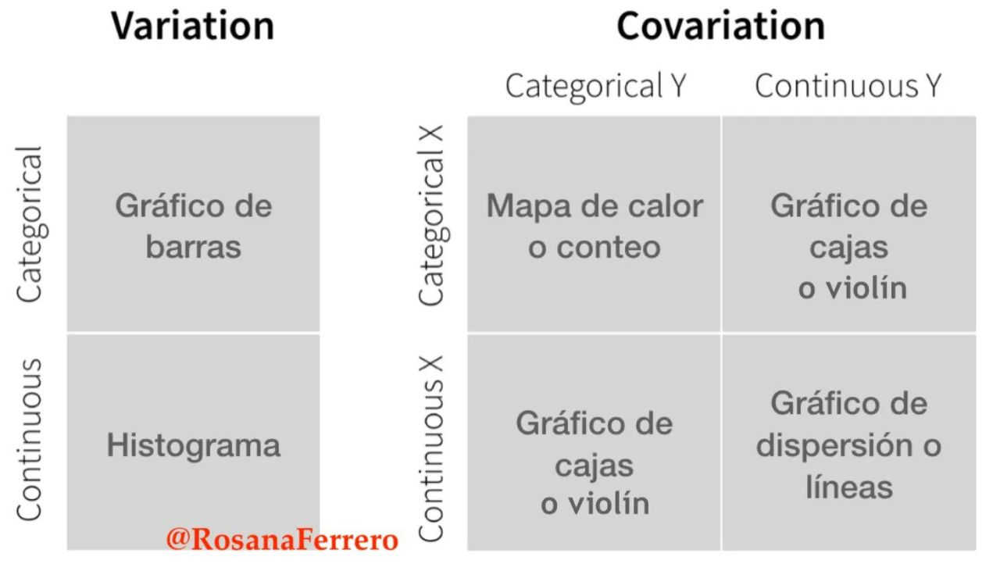

# Apuntes de R Programming

## Conocer la codificación de texto

```r
readr::guess_encoding(texto)
parse_character(, locale=locale(encoding="UTF-8"))
```

## Generar caracteres Unicode

```r
uranges <- Unicode::u_scripts()
expand_uranges <- lapply(uranges, as.u_char_seq)
all_unicode_chars <- unlist(expand_uranges)
```

## Instalar versiones anteriores de los paquetes

### Usando devtools

```r
require(devtools)
install_version("ggplot2", version = "0.9.1", repos = "http://cran.us.r-project.org")
```

### Usando una dirección

```r
packageurl <- "http://cran.r-project.org/src/contrib/Archive/ggplot2/ggplot2_0.9.1.tar.gz"
install.packages(packageurl, repos=NULL, type="source")
```

### Usando línea de comandos

```r
wget http://cran.r-project.org/src/contrib/Archive/ggplot2/ggplot2_0.9.1.tar.gz
R CMD INSTALL ggplot2_0.9.1.tar.gz
```

## Personalizar RStudio

- [Dracula](https://draculatheme.com/rstudio)

- [Synthwave85](https://github.com/jnolis/synthwave85)

- [Darkstudio](https://rileytwo.github.io/darkstudio/)

- [Rscodeio](https://github.com/anthonynorth/rscodeio)

- [Rsthemes](https://www.garrickadenbuie.com/project/rsthemes/)

- [RStudio themes](https://github.com/mkearney/rstudiothemes)

# Análisis Exploratorio de datos (EDA)

## Estadísticos y gráficos

<div style="display: flex; justify-content: center;">
    
    
</div>

### [Estimación de la Moda](https://r-coder.com/moda-r/)

#### Estimación unimodal discreta

```r
x <- c(1, 5, 1, 6, 2, 1, 6, 7, 1)

mode <- function(x) {
  return(
    base::as.numeric(
      base::names(
        base::which.max(
          base::table(x)))))
}

mode(x) # 1
```
**Gráficamente:**

```r
n = base::length(base::table(x)) - 1

graphics::barplot(
  height = base::table(x),
  col = c(4, base::rep("gray", n)))

graphics::legend(
  x = "topright", 
  y = "Moda", 
  fill = 4)
```

### Estimación unimodal continua

```r
base::set.seed(1234)
x2 <- stats::rnorm(1000)

modeest::mlv(
  x = x2,
  method = "meanshift")
```

### Estimación multimodal discreta

```r
y <- c(3, 5, 3, 3, 5, 6, 5)

modeest::mlv(
  x = y, 
  method = "mfv")
```

### Estimación multimodal continua

```r
n <- 1000
bin <- stats::rbinom(n, 1, 0.6)
y2 <- stats::rnorm(n, mean = 120, sd = 11) * bin + 
  stats::rnorm(n, mean = 40, sd = 5) * (1 - bin)

modas <- multimode::locmodes(data = y2, mod0 = 2)
modas

graphics::plot(modas)
```
